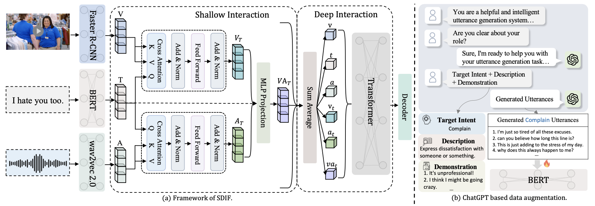

# SDIF-DA: A Shallow-to-Deep Interaction Framework with Data Augmentation for Multi-modal Intent Detection

This repository contains the official `PyTorch` implementation of the paper "SDIF-DA: A Shallow-to-Deep Interaction Framework with Data Augmentation for Multi-modal Intent Detection".

In the following, we will guide you how to use this repository step by step.

## Abstract

Multi-modal intent detection aims to utilize various modalities to understand the user’s intentions, which is essential for the deployment of dialogue systems in real-world scenarios. The two core challenges for multi-modal intent detection are (1) how to effectively align and fuse different features of modalities and (2) the limited labeled multi-modal intent training data. In this work, we introduce a shallow-to-deep interaction framework with data augmentation (SDIF-DA) to address the above challenges. Firstly, SDIF-DA leverages a shallow-to-deep interaction module to progressively and effectively align and fuse features across text, video, and audio modalities. Secondly, we propose a ChatGPT-based data augmentation approach to automatically augment sufficient training data. Experimental results demonstrate that SDIF-DA can effectively align and fuse multi-modal features by achieving state-of-the-art performance. In addition, extensive analyses show that the introduced data augmentation approach can successfully distill knowledge from the large language model.

## Architecture



## Results


## Preparation

Our code is based on PyTorch 1.11 (Cuda version 10.2), required python packages:

-   pytorch==1.11.0
-   python==3.8.13
-   transformers==4.25.1
-   wandb==0.14.1
-   scikit-learn==1.1.2
-   tqdm==4.64.0

We highly suggest you using [Anaconda](https://www.anaconda.com/) to manage your python environment. If so, you can run the following command directly on the terminal to create the environment:

```
conda create -n env_name python=3.8.13   
source activate env_name     
pip install -r requirements.txt
```

## How to run it
### Data preparation

The text data and our augmentation data are already put in  `data/MIntRec`, for the video and audio data, download the MIntRec dataset: [Google Drive](https://drive.google.com/drive/folders/18iLqmUYDDOwIiiRbgwLpzw76BD62PK0p?usp=sharing) or [BaiduYun Disk](https://pan.baidu.com/s/1xWcrNL-lUiUSLklnozyQvQ) (code：95lo), and put audio data `audio_feats.pkl`, video data `video_feats.pkl` into path `data/MIntRec`

### Run

The script **run.py** acts as a main function to the project, you can run the experiments by the following commands.

```Shell
# Binary-class
python run.py --gpu_id '0' --train --config_file_name 'sdif_bi.py' > SDIF_DA_binary.log 2>&1 & 

# Twenty-class
python run.py --gpu_id '0' --train --config_file_name 'sdif.py' > SDIF_DA_twenty.log 2>&1 & 
```

## Reference

If you find this project useful for your research, please consider citing the following paper:

```
@misc{huang2023sdifda,
      title={SDIF-DA: A Shallow-to-Deep Interaction Framework with Data Augmentation for Multi-modal Intent Detection}, 
      author={Shijue Huang and Libo Qin and Bingbing Wang and Geng Tu and Ruifeng Xu},
      year={2023},
      eprint={2401.00424},
      archivePrefix={arXiv},
      primaryClass={cs.CL}
}
```

If you have any question, please issue the project or email [Shijue Huang](mailto:joehsj310@gmail.com) and we will reply you soon.